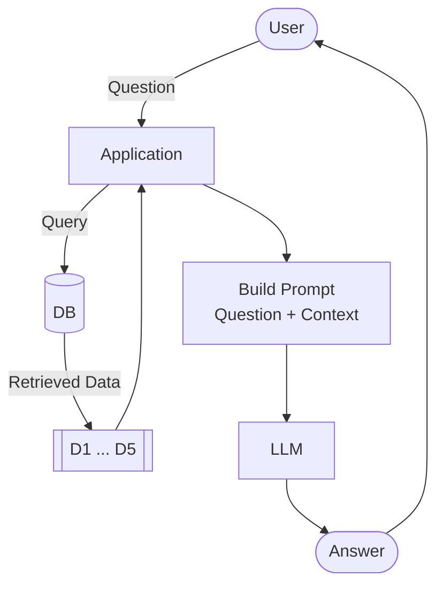

```python
from dotenv import load_dotenv
load_dotenv()

from openai import OpenAI
openai_client = OpenAI()
import os

# Reuse the existing client if it was already created in another cell
if "openai_client" not in globals():
    openai_client = OpenAI(api_key=os.getenv("OPENAI_API_KEY"))
```


```python
openai_client
```


    <openai.OpenAI at 0x22ef220c140>


In this course our running project is to build a bot that can answer queries related to the course. 

Datatalks-Club runs free ZoomCamps on data engineering, machine learning, MLOps, and other topics. Each course has its own FAQ document with common questions and answers. Many of the questions are common across different FAQ documents, but they might be differently worded, or the responses might be differently structuresd. Also there might be some questions that are very course specific.

We need to build a bot that can ingest all this knowledge and give answers in natural language.

# RAG
* Why we need RAG?
LLMs are trained on Billions of features, they have the entire knowledge of the internet. Why not just ask a question to LLM and be done with it.


Let's build a function that takes our question, serves it to an LLM model ("gpt-5.4-mini" in this case) and returns the response.


```python
def llm(prompt):
    response = openai_client.responses.create(
        model="gpt-5.4-mini",
        input=prompt
    )
    return response.output_text
```

Let's see how it goes


```python
llm("Hey Bro, how is life treating you?")
```


    'Hey bro — pretty good on my side, thanks for asking 😄  \nHow’s life treating you?'


Now, let's see how it does with course specific questions.


```python
question = "I just discovered the course. Can I still join?"
llm_response = llm(question)
print(f"ResourceWarning: {llm_response}")
```

    ResourceWarning: Absolutely — if enrollment is still open, you can usually still join.
    
    If you want, I can help you figure out:
    - whether the course is still accepting students
    - how to enroll late, if that’s allowed
    - what to do if you missed the start date
    
    If you’d like, send me the course name or link and I’ll help you check.
    

It's evident that the LLMs would rarely say "I don't know the answer to your question". Here also LLM has given a vague answer. If we ask it about "How to make Biryani?" which is a common knowledge question (Although, making a good Biryani is still very difficult :-), LLMs can fairly answer this question. But they do not know much about LLM-Zoomcamp and they give generic answers. 

## Why is that??
This is because the LLM model is trained on the intelligence openly available on the internet. But there is always some cutoff to the training data's recency. For example, the training data for some LLM is fixed to 30th April 2026, and some event happened on 1st may 2026; the LLM would have no clue about that.

## Adding context manually

Adding context can fix this short-coming of LLMs. LLM zoomcamp website have a lot of FAQs. We get some answers from there and add that to context.


```python
context = """
I just discovered the course. Can I still join?
Yes, but if you want to receive a certificate, you need to submit your project while we're still accepting submissions.

Course: I have registered for the LLM Zoomcamp. When can I expect to receive the confirmation email?
You don't need it. You're accepted. You can also just start learning and submitting homework (while the form is open) without registering. It is not checked against any registered list. Registration is just to gauge interest before the start date.

What is the video/zoom link to the stream for the "Office Hours" or live/workshop sessions?
The zoom link is only published to instructors/presenters/TAs. Students participate via YouTube Live and submit questions to Slido.

Cloud alternatives with GPU
Check the quota and reset cycle carefully. Potential options include Google Colab, Kaggle, Databricks.
"""
```


```python
prompt = f"""
Your task is to answer questions from the course participants
based on the provided context.

Use the context to find relevant information and provide accurate
answers. If the answer is not found in the context,
respond with "I don't know."

Question:
{question}

Context:
{context}
"""
```


```python
answer = llm(prompt)
print(answer)
```

    Yes, you can still join. If you want to receive a certificate, make sure to submit your project while submissions are still open.
    

## RAG
RAG stands for *R*etrival *A*ugmented *G*eneration. We retrieve (search) relevant information from documents in our Knowledge base and then augment LLM to generate a response. That search step is what gives the LLM the context it needs to answer correctly.
So, what's happening here is the *Retrival of Information and Generation*.


That's the entire architecture. It comes down to three components.

The pieces are search, the prompt, and the LLM:

- search
- prompt
- LLM

The LLM only see the data we provide to it; so it's answers are grounded to our data. If right data is retrieved, our answers will be better. if wrong data is retrieved, our answers will not be accurate. Our model is only as good as our retrieval. So search quality matters a lot for RAG.
