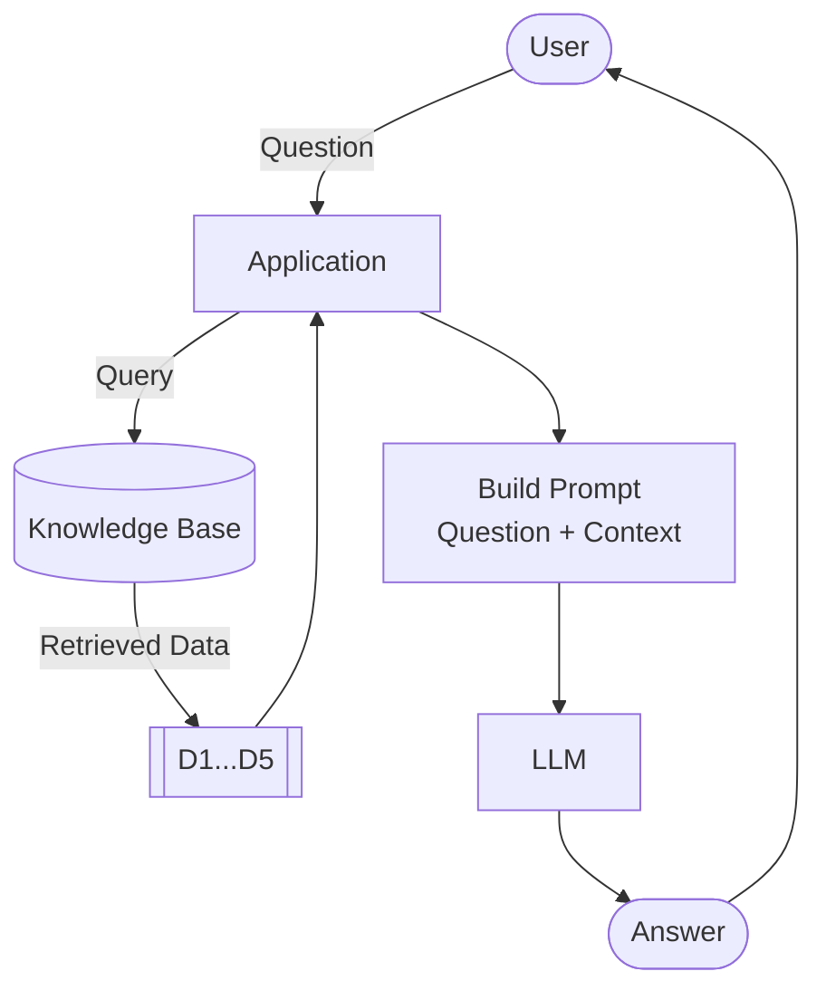

# Learning in Public: Building a RAG Bot for LLM Zoomcamp

```text
As part of my journey through the DataTalks.Club LLM Zoomcamp, I'm practicing the "learning in public" approach. Instead of keeping my notes tucked away in a local folder, I'm sharing my execution steps, code snippets, and mental models as I build out our running project: a question-answering bot tailored specifically for the course itself. Here is a breakdown of my first hands-on steps with LLMs and the core mechanics of Retrieval-Augmented Generation (RAG).
```

In this course, our running project is to build a bot that can answer queries related to the course.

DataTalks.Club runs free ZoomCamps on data engineering, machine learning, MLOps, and other topics. Each course has its own FAQ document containing common questions and answers. Many of these questions overlap across different tracks, but they might be worded differently, or the responses might be structured differently. Additionally, some questions are highly course-specific.

We need to build a bot that can ingest all of this knowledge and provide accurate answers in natural language.

## RAG: Retrieval-Augmented Generation

*Why we need RAG?*

LLMs are trained on billions of parameters and capture a    massive footprint of the internet's public knowledge. So, why not just ask the LLM a question directly and be done with it?

Let's test this by building a simple function that takes a question, passes it to an LLM (gpt-5.4-mini in this case), and returns the response.

```python

from dotenv import load_dotenv
load_dotenv()

from openai import OpenAI
openai_client = OpenAI()
import os

openai_client = OpenAI(api_key=os.getenv("OPENAI_API_KEY"))


def llm(prompt):
    response = openai_client.responses.create(
        model="gpt-5.4-mini",
        input=prompt
    )
    return response.output_text
```

Let's see how it goes

```python
llm("Hey Bro, how is life treating you?")
```

Here is how LLM model responded.

    'Hey bro — pretty good on my side, thanks for asking 😄  \n How’s life treating you?'

Now, let's see how it handles a course-specific question.

```python
question = "I just discovered the course. Can I still join?"
llm_response = llm(question)
print(f"ResourceWarning: {llm_response}")
```

    ResourceWarning: Absolutely — if enrollment is still open, you can usually still join.
    
    If you want, I can help you figure out:
    - whether the course is still accepting students
    - how to enroll late, if that’s allowed
    - what to do if you missed the start date
    
    If you’d like, send me the course name or link and I’ll help you check.
    

It is evident that LLMs will rarely say, "I don't know the answer to your question." Instead, the model provides a vague, generic response.

If we ask it, "How do I make Biryani?"—which is a common knowledge question (although making a truly good Biryani is still an art form! 😅)—the LLM answers beautifully. But because it lacks specific knowledge about the LLM Zoomcamp, it hallucinates a polite, generic fallback.

## Why does this happen?

An LLM is trained on publicly available data up to a specific knowledge cutoff point. If an LLM's training data cuts off on April 30, 2026, and a new event occurs on May 1, 2026, the model will have no clue about it. More importantly, it doesn't have access to private, internal, or highly niche documents—like our course FAQs.

## Adding context manually

We can fix this shortcoming by manually providing the necessary context to the LLM. Let's pull some actual FAQ data from the LLM Zoomcamp website and pass it along with our query.

```python
context = """
I just discovered the course. Can I still join?
Yes, but if you want to receive a certificate, you need to submit your project while we're still accepting submissions.

Course: I have registered for the LLM Zoomcamp. When can I expect to receive the confirmation email?
You don't need it. You're accepted. You can also just start learning and submitting homework (while the form is open) without registering. It is not checked against any registered list. Registration is just to gauge interest before the start date.

What is the video/zoom link to the stream for the "Office Hours" or live/workshop sessions?
The zoom link is only published to instructors/presenters/TAs. Students participate via YouTube Live and submit questions to Slido.

Cloud alternatives with GPU
Check the quota and reset cycle carefully. Potential options include Google Colab, Kaggle, Databricks.
"""
```

Now, let's construct a structured prompt that instructs the LLM to behave strictly as an assistant grounded in this data.

```python
prompt = f"""
Your task is to answer questions from the course participants
based on the provided context.

Use the context to find relevant information and provide accurate
answers. If the answer is not found in the context,
respond with "I don't know."

Question:
{question}

Context:
{context}
"""
```

```python
answer = llm(prompt)
print(answer)
```

    Yes, you can still join. If you want to receive a certificate, make sure to submit your project while submissions are still open.
    

## Deconstructing the Architecture

RAG stands for **R**etrival-**A**ugmented **G**eneration.
Instead of relying solely on the LLM's internal weights, we retrieve relevant documents from our knowledge base and augment the prompt to give the model the precise context it needs to generate an accurate answer.

Ultimately, the entire architecture boils down to three core pillars:

- Search
- Prompt
- LLM

We retrieve (search) relevant information from documents in our Knowledge base and then augment LLM to generate a response.



Because the LLM only sees the data we explicitly hand to it, its answers are entirely grounded. If we retrieve the right data, the answer is spot-on. If we retrieve the wrong data, the answer degrades.

In short: Our generative model is only as good as our retrieval engine. This is why search quality is the most critical factor in production-grade RAG pipelines.
